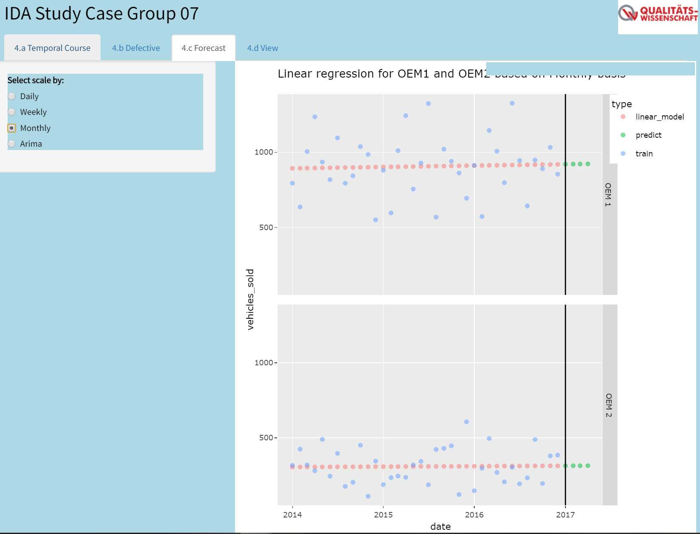

```{r setup, include=FALSE}
knitr::opts_chunk$set(echo = TRUE)
```

## Description of Study Case

A large car dealership is about to open a new branch in Dortmund. We are tasked to select the choice of cars between OEM1 and OEM2. The goal of this new car dealership selection is to increase the sales figure after a long period of low sales. For this, our team needs to analyze the registrations of the last three years from 2014 until 2016. In this selection, neighboring towns of Bochum Gelsenkirchen, Hilden and Nordkirchen should be considered. Important criterias for this selection are sales figures and susceptibility to errors.

In this study case, our first task is to analyze the temporal course of sales figures for both brands in Dortmund, Bochum, Gelsenkirchen, Hilden and Nordkirchen. For the second task, we must create a figure to visualize the relative proportion of defective registered vehicles of the respective brand. Besides that, the user should also be able to recognize the relative proportion of defective component and parts. For both tasks, filtering by location and time period of registration should be possible. Afterwards, a sales forecast is required to show the development of sales figures for both brands for the next quarter which is Q1 2017. Based on this, the team must recommend the most suitable car brand.

## Libraries

At first, we need to install and load the package `install.load` to ease the loading process of relevant packages, that are used in this study case. Relevant packages are `tidyverse` and `data.table`. Besides that, `fitdistrplus`, `MASS` and `stats` must be unloaded due to interference with some functions from `dplyr`.

```{r message = FALSE, warning = FALSE}
if(!require(install.load)){
  install.packages("install.load")
  library(install.load)
}


install_load("tidyverse", "data.table","knitr","forecast","modelr")
library(tidyverse)
library(data.table)
library(knitr)
library(forecast)
library(modelr)
if ("fitdistrplus" %in% (.packages())){
detach(package: fitdistrplus, unload = TRUE)
}

if ("fitdistrplus" %in% (.packages())){
detach(package: MASS, unload = TRUE)
}

if ("fitdistrplus" %in% (.packages())){
detach(package: stats, unload = TRUE)
}

```

## 0. Functions
Some data sets consist of columns, that are repeated twice. To ease the process of data preparation, this columns should be merged. To do this, following function is implemented:
```{r message = FALSE, warning = FALSE}
merge_xy <- function(data) {
  data_x <- data[,1:2] %>% na.omit(1) %>% rename(V1 = 1, V2 = 2)
  data_y <- data[,3:4] %>% na.omit(1) %>% rename(V1 = 1, V2 = 2)
  
  data <- bind_rows(data_x, data_y)
}
```

Some data sets consist of columns, that are repeated three times To ease the process of data preparation, this columns should be merged. To do this, following function is implemented:
```{r message = FALSE, warning = FALSE}
merge_xyz <- function(data) {
  data_x <- data[,1:2] %>% na.omit(1) %>% rename(V1 = 1, V2 = 2)
  data_y <- data[,3:4] %>% na.omit(1) %>% rename(V1 = 1, V2 = 2)
  data_z <- data[,5:6] %>% na.omit(1) %>% rename(V1 = 1, V2 = 2)
  
  data <- bind_rows(data_x, data_y, data_z)
}
```

The part list datasets (Bestandteile Komponente) contain either 3, 4, or 5 different parts. To merge all data sets into one single data set, the datasets with only 3 and 4 different parts need to be reformated to accomodate the number of columns inside dataset with 5 parts. These extra colums are filled with `NA`.

Following function is intended to reformat part list datasets (Bestandteile Komponente) with 4 different part to accomodate datasets with 5 parts.
```{r message = FALSE, warning = FALSE}
reformat_5cols <- function(data) {
  data <- data %>% 
    mutate(ID_T_5 = NA) %>% 
    select(5, 1:4, 6) %>% 
    rename(ID_K = 1, ID_T_1 = 2, ID_T_2 = 3, ID_T_3 = 4, ID_T_4 = 5, ID_T_5 = 6)
}
```

Following function is intended to reformat part list datasets (Bestandteile Komponente) with 3 different part to accomodate datasets with 5 parts.
```{r message = FALSE, warning = FALSE}
reformat_4cols <- function(data) {
  data <- data %>% 
    mutate(ID_T_4 = NA, ID_T_5 = NA) %>% 
    select(4, 1:3, 5:6) %>% 
    rename(ID_K = 1, ID_T_1 = 2, ID_T_2 = 3, ID_T_3 = 4, ID_T_4 = 5, ID_T_5 = 6)
}
```

## 1. Import all relevant datasets
### Importing vehicle dataset, component list, and registeration

As explained above, the task of this study case is to analyze the number of registered vehicles from OEM1 and OEM2 within the above mentioned time frame and location and to analyze the number of their defectives on vehicle, component and single part level. The main task for importing is to extract the relevant vehicle id numbers, their registration date, location of registration, the number of defective vehicles, the number of defective components and the number of defective single parts from the provided data.

The first step towards this analysis is to import the list of registered vehicles from `Zulassungen_alle_Fahrzeuge.csv` dataset. First column which contains number of lines is removed to reduce the size of the data.
```{r message = FALSE, warning = FALSE}
zulassungen <- fread("Data/Zulassungen/Zulassungen_alle_Fahrzeuge.csv") %>% select(-1)
```

To determine which type of vehicle from OEM 1 and OEM 2, that are relevant for this analysis, following code is implemented.
```{r}
unique(substr(zulassungen$IDNummer, 1,4))
```
Based on this result, we need to import vehicle Type 11 and Type 12 from OEM1 and Type 21 and Type 22 from OEM2. In this case, only relevant columns are imported, which are: `ID_Fahrzeug`, `Herstellernummer`, `Fehlerhaft`.

```{r message = FALSE, warning = FALSE}
fahrzeuge_oem1_typ11 <- fread("Data/Fahrzeug/Fahrzeuge_OEM1_Typ11.csv") %>% select(3, 5, 7)
fahrzeuge_oem1_typ12 <- fread("Data/Fahrzeug/Fahrzeuge_OEM1_Typ12.csv") %>% select(3, 5, 7)
fahrzeuge_oem2_typ21 <- fread("Data/Fahrzeug/Fahrzeuge_OEM2_Typ21.csv") %>% select(3, 4, 6)
fahrzeuge_oem2_typ22 <- fread("Data/Fahrzeug/Fahrzeuge_OEM2_Typ22.csv") %>% select(3, 4, 6)
```

To determine which component datasets are needed, we need to import component list of vehicles (Bestandteile Fahrzeuge). Relevant columns are: `ID_Fahrzeug`, `ID_Karosserie`, `ID_Schaltung`, `ID_Sitze` and `ID_Motor`.

```{r message = FALSE, warning = FALSE}
bestandteile_fahrzeuge_oem1_typ11 <- fread("Data/Fahrzeug/Bestandteile_Fahrzeuge_OEM1_Typ11.csv", header = TRUE) %>% 
  select(6, 2:5)

bestandteile_fahrzeuge_oem1_typ12 <- fread("Data/Fahrzeug/Bestandteile_Fahrzeuge_OEM1_Typ12.csv", header = TRUE) %>% 
  select(6, 2:5)

bestandteile_fahrzeuge_oem2_typ21 <- fread("Data/Fahrzeug/Bestandteile_Fahrzeuge_OEM2_Typ21.csv", header = TRUE) %>% 
  select(6, 2:5)

bestandteile_fahrzeuge_oem2_typ22 <- fread("Data/Fahrzeug/Bestandteile_Fahrzeuge_OEM2_Typ22.csv", header = TRUE) %>% 
  select(6, 2:5)
```

### Joining vehicle and component list of vehicles datasets

Vehicle data sets (Fahrzeuge) are then joined into one single dataset. The single data sets are removed afterwards to save memory.

```{r message = FALSE, warning = FALSE}
fahrzeuge_all <- rbind(fahrzeuge_oem1_typ11,
                       fahrzeuge_oem1_typ12,
                       fahrzeuge_oem2_typ21,
                       fahrzeuge_oem2_typ22)

rm(fahrzeuge_oem1_typ11,
   fahrzeuge_oem1_typ12,
   fahrzeuge_oem2_typ21,
   fahrzeuge_oem2_typ22)
```

Component lists of vehicles (Bestandteile Fahrzeuge) are joined into one single data. The single data sets are then removed to save memory.
```{r message = FALSE, warning = FALSE}
bestandteile_fahrzeuge_all <- rbind(bestandteile_fahrzeuge_oem1_typ11,
                                    bestandteile_fahrzeuge_oem1_typ12,
                                    bestandteile_fahrzeuge_oem2_typ21,
                                    bestandteile_fahrzeuge_oem2_typ22)

rm(bestandteile_fahrzeuge_oem1_typ11,
   bestandteile_fahrzeuge_oem1_typ12,
   bestandteile_fahrzeuge_oem2_typ21,
   bestandteile_fahrzeuge_oem2_typ22)
```

### Filtering registration by date and location

The data set of vehicle registration is filtered by year 2014 - 2016 and by following location: Dortmund, Bochum, Gelsenkirchen, Hilden and Nordkirchen.

```{r message = FALSE, warning = FALSE}
zulassungen_filter <- zulassungen %>% 
  filter(Gemeinden %in% c("DORTMUND", "BOCHUM", "GELSENKIRCHEN", "HILDEN", "NORDKIRCHEN")) %>% 
  filter(Zulassung >= "2014-01-01" & Zulassung <= "2016-12-31") %>% 
  arrange(Zulassung, IDNummer)
```


### Joining filtered registration, vehicle and component list
This filtered registration data would then be joined with the combined vehicle and component dataset with `left_join()` function with `IDNummer` and `ID_Fahrzeug` column as matching criteria. All previous data sets would then be removed to save memory.

```{r message = FALSE, warning = FALSE}
zulassungen_componentList <- zulassungen_filter %>% 
  left_join(fahrzeuge_all, by = c("IDNummer" = "ID_Fahrzeug")) %>% 
  rename("Defective Vehicle" = "Fehlerhaft") %>% 
  left_join(bestandteile_fahrzeuge_all, by = c("IDNummer" = "ID_Fahrzeug"))

rm(fahrzeuge_all, zulassungen, zulassungen_filter, bestandteile_fahrzeuge_all)
```

### Finding relevant component dataset
Before importing the component data sets, it is important to know which components are relevent. The following code is used to find the relevant components for this study case.
```{r}
unique(substr(zulassungen_componentList$ID_Karosserie, 1,2))
unique(substr(zulassungen_componentList$ID_Schaltung, 1,5))
unique(substr(zulassungen_componentList$ID_Sitze, 1,5))
unique(substr(zulassungen_componentList$ID_Motor, 1,5))
```
Based on this result, all components are required to be imported. The next step is to determine, which single part datasets are required.

### Creating lists of all relevant components based on the component type

To ease the filtering process of component data sets after importing, we summarized all relevant components in a list.
```{r message = FALSE, warning = FALSE}
karosserie <- select(zulassungen_componentList, ID_Karosserie)
schaltung <- select(zulassungen_componentList, ID_Schaltung)
sitze <- select(zulassungen_componentList, ID_Sitze)
motor <- select(zulassungen_componentList, ID_Motor)

componentList <- rbind(karosserie, schaltung, sitze, motor, use.names = FALSE) %>% rename("ID_K" = 1)
rm(karosserie, schaltung, sitze, motor)
```


### Importing single part list datasets
Function `fread()` with header-value set to `TRUE` is used for importing the all single part list data sets (Bestandteile Komponente). The first column is removed to simplify the data set. Afterwards, the imported data sets are filtered with `semi_join()` function by the relevant components only to save memory.
```{r message = FALSE, warning = FALSE}
# Component List of Motor
bestandteile_komponente_k1be1 <- fread("Data/Komponente/Bestandteile_Komponente_K1BE1.csv", header = TRUE) %>% 
  select(-1) %>% 
  semi_join(componentList, by = c("ID_K1BE1" = "ID_K"))

bestandteile_komponente_k1be2 <- fread("Data/Komponente/Bestandteile_Komponente_K1BE2.csv", header = TRUE) %>% 
  select(-1) %>% 
  semi_join(componentList, by = c("ID_K1BE2" = "ID_K"))

bestandteile_komponente_k1di1 <- fread("Data/Komponente/Bestandteile_Komponente_K1DI1.csv", header = TRUE) %>% 
  select(-1) %>% 
  semi_join(componentList, by = c("ID_K1DI1" = "ID_K"))

bestandteile_komponente_k1di2 <- fread("Data/Komponente/Bestandteile_Komponente_K1DI2.csv", header = TRUE) %>% 
  select(-1) %>% 
  semi_join(componentList, by = c("ID_K1DI2" = "ID_K"))

# Component List of Seat
bestandteile_komponente_k2le1 <- fread("Data/Komponente/Bestandteile_Komponente_K2LE1.csv", header = TRUE) %>% 
  select(-1) %>% 
  semi_join(componentList, by = c("ID_K2LE1" = "ID_K"))

bestandteile_komponente_k2le2 <- fread("Data/Komponente/Bestandteile_Komponente_K2LE2.csv", header = TRUE) %>% 
  select(-1) %>% 
  semi_join(componentList, by = c("ID_K2LE2" = "ID_K"))

bestandteile_komponente_k2st1 <- fread("Data/Komponente/Bestandteile_Komponente_K2ST1.csv", header = TRUE) %>% 
  select(-c(1,2)) %>% 
  semi_join(componentList, by = c("ID_K2ST1" = "ID_K"))

bestandteile_komponente_k2st2 <- fread("Data/Komponente/Bestandteile_Komponente_K2ST2.csv", header = TRUE) %>% 
  select(-1) %>% 
  semi_join(componentList, by = c("ID_K2ST2" = "ID_K"))

# Component List of Transmission
bestandteile_komponente_k3ag1 <- fread("Data/Komponente/Bestandteile_Komponente_K3AG1.csv", header = TRUE) %>% 
  select(-1) %>% 
  semi_join(componentList, by = c("ID_K3AG1" = "ID_K"))

bestandteile_komponente_k3ag2 <- fread("Data/Komponente/Bestandteile_Komponente_K3AG2.csv", header = TRUE) %>% 
  select(-1) %>% 
  semi_join(componentList, by = c("ID_K3AG2" = "ID_K"))

bestandteile_komponente_k3sg1 <- fread("Data/Komponente/Bestandteile_Komponente_K3SG1.csv", header = TRUE) %>% 
  select(-1) %>% 
  semi_join(componentList, by = c("ID_K3SG1" = "ID_K"))

bestandteile_komponente_k3sg2 <- fread("Data/Komponente/Bestandteile_Komponente_K3SG2.csv", header = TRUE) %>% 
  select(-1) %>% 
  semi_join(componentList, by = c("ID_K3SG2" = "ID_K"))

# Component List of Karosserie
bestandteile_komponente_k4 <- fread("Data/Komponente/Bestandteile_Komponente_K4.csv", header = TRUE) %>% 
  select(-1) %>% 
  semi_join(componentList, by = c("ID_K4" = "ID_K"))

bestandteile_komponente_k5 <- fread("Data/Komponente/Bestandteile_Komponente_K5.csv", header = TRUE) %>% 
  select(-1) %>% 
  semi_join(componentList, by = c("ID_K5" = "ID_K"))

bestandteile_komponente_k6 <- fread("Data/Komponente/Bestandteile_Komponente_K6.csv", header = TRUE) %>% 
  select(-1) %>% 
  semi_join(componentList, by = c("ID_K6" = "ID_K"))

bestandteile_komponente_k7 <- fread("Data/Komponente/Bestandteile_Komponente_K7.csv", header = TRUE) %>% 
  select(-1) %>% 
  semi_join(componentList, by = c("ID_K7" = "ID_K"))

```

### Joining single part lists into a single dataset
All lists of single parts inside component (Bestandteile Komponente) are joined into one single data. One component has 5 single parts, the others come with either 3 or 4 single parts. To join these together into one single dataset, extra 1 or 2 columns with NA value must be added to each component list dataset. To to this, the function `reformat_5cols()` and `reformat_4cols()` are used. Afterwards, these data sets are combined in a single one and removed from workspace to save memory.

```{r message = FALSE, warning = FALSE}
bestandteile_komponente_k1be1 <-  reformat_5cols(bestandteile_komponente_k1be1)
bestandteile_komponente_k1be2 <-  reformat_5cols(bestandteile_komponente_k1be2)
bestandteile_komponente_k1di1 <- reformat_5cols(bestandteile_komponente_k1di1)
bestandteile_komponente_k1di2 <- reformat_5cols(bestandteile_komponente_k1di2)

bestandteile_komponente_k2le1 <- reformat_4cols(bestandteile_komponente_k2le1)
bestandteile_komponente_k2le2 <- reformat_4cols(bestandteile_komponente_k2le2)
bestandteile_komponente_k2st1 <- reformat_4cols(bestandteile_komponente_k2st1)
bestandteile_komponente_k2st2 <- reformat_4cols(bestandteile_komponente_k2st2)

bestandteile_komponente_k3ag1 <- reformat_4cols(bestandteile_komponente_k3ag1)
bestandteile_komponente_k3ag2 <- reformat_4cols(bestandteile_komponente_k3ag2)
bestandteile_komponente_k3sg1 <- reformat_4cols(bestandteile_komponente_k3sg1)
bestandteile_komponente_k3sg2 <- reformat_4cols(bestandteile_komponente_k3sg2)

bestandteile_komponente_k4 <- reformat_4cols(bestandteile_komponente_k4)
bestandteile_komponente_k5 <- reformat_4cols(bestandteile_komponente_k5)
bestandteile_komponente_k6 <- reformat_5cols(bestandteile_komponente_k6)
bestandteile_komponente_k7 <- bestandteile_komponente_k7 %>% select(6, 1:5)

bestandteile_komponente_all <- rbind(bestandteile_komponente_k1be1, bestandteile_komponente_k1be2,
                                     bestandteile_komponente_k1di1, bestandteile_komponente_k1di2,
                                     bestandteile_komponente_k2le1, bestandteile_komponente_k2le2,
                                     bestandteile_komponente_k2st1, bestandteile_komponente_k2st2,
                                     bestandteile_komponente_k3ag1, bestandteile_komponente_k3ag2,
                                     bestandteile_komponente_k3sg1, bestandteile_komponente_k3sg2,
                                     bestandteile_komponente_k4, bestandteile_komponente_k5, 
                                     bestandteile_komponente_k6, bestandteile_komponente_k7,
                                     use.names = FALSE)
rm(bestandteile_komponente_k1be1, bestandteile_komponente_k1be2,
   bestandteile_komponente_k1di1, bestandteile_komponente_k1di2,
   bestandteile_komponente_k2le1, bestandteile_komponente_k2le2,
   bestandteile_komponente_k2st1, bestandteile_komponente_k2st2,
   bestandteile_komponente_k3ag1, bestandteile_komponente_k3ag2,
   bestandteile_komponente_k3sg1, bestandteile_komponente_k3sg2,
   bestandteile_komponente_k4, bestandteile_komponente_k5, 
   bestandteile_komponente_k6, bestandteile_komponente_k7 
   )
```

### Joining filtered registration with whole single part list dataset
The filtered registration data `zulassungen_componentList` is joined with the combined single part list `bestandteile_komponente_all` data set with `left_join()` function with `ID_K` paired with `ID_Karosserie`, `ID_Schaltung`, `ID_Sitze` and `ID_Motor` column as matching criteria. Each part id column is then renamed accordingly.The column `ID_Schaltung_T_4`, `ID_Schaltung_T_5`, `ID_Sitze_T_4` and `ID_Sitze_T_5` are removed since all transmission and seats have only 3 components. The column`ID_Motor_T_5` is removed since all motor have only 4 components. The data set `zulassungen_componentList` and `bestandteile_komponente_all` are then removed to free up memory.

```{r message = FALSE, warning = FALSE}
zulassungen_partList <- zulassungen_componentList %>% 
  left_join(bestandteile_komponente_all, by = c("ID_Karosserie" = "ID_K")) %>% 
  rename("ID_Karosserie_T_1" = "ID_T_1", "ID_Karosserie_T_2" = "ID_T_2", "ID_Karosserie_T_3" = "ID_T_3",
         "ID_Karosserie_T_4" = "ID_T_4", "ID_Karosserie_T_5" = "ID_T_5") %>% 
  left_join(bestandteile_komponente_all, by = c("ID_Schaltung" = "ID_K")) %>% 
  rename("ID_Schaltung_T_1" = "ID_T_1", "ID_Schaltung_T_2" = "ID_T_2", "ID_Schaltung_T_3" = "ID_T_3",
         "ID_Schaltung_T_4" = "ID_T_4", "ID_Schaltung_T_5" = "ID_T_5") %>% 
  select(-c("ID_Schaltung_T_4", "ID_Schaltung_T_5")) %>% 
  left_join(bestandteile_komponente_all, by = c("ID_Sitze" = "ID_K")) %>% 
  rename("ID_Sitze_T_1" = "ID_T_1", "ID_Sitze_T_2" = "ID_T_2", "ID_Sitze_T_3" = "ID_T_3",
         "ID_Sitze_T_4" = "ID_T_4", "ID_Sitze_T_5" = "ID_T_5") %>% 
  select(-c("ID_Sitze_T_4", "ID_Sitze_T_5")) %>% 
  left_join(bestandteile_komponente_all, by = c("ID_Motor" = "ID_K")) %>% 
  rename("ID_Motor_T_1" = "ID_T_1", "ID_Motor_T_2" = "ID_T_2", "ID_Motor_T_3" = "ID_T_3",
         "ID_Motor_T_4" = "ID_T_4", "ID_Motor_T_5" = "ID_T_5") %>% 
  select(-"ID_Motor_T_5")

rm(zulassungen_componentList, bestandteile_komponente_all)
```

### Finding relevant single part dataset
The following code is used to find the relevant single part for this study case.
```{r}
c(unique(substr(zulassungen_partList$ID_Karosserie_T_1, 1,2)), unique(substr(zulassungen_partList$ID_Karosserie_T_2, 1,2)),
  unique(substr(zulassungen_partList$ID_Karosserie_T_3, 1,2)), unique(substr(zulassungen_partList$ID_Karosserie_T_4, 1,2)),
  unique(substr(zulassungen_partList$ID_Karosserie_T_5, 1,2)),  unique(substr(zulassungen_partList$ID_Schaltung_T_1, 1,2)),
  unique(substr(zulassungen_partList$ID_Schaltung_T_2, 1,2)),  unique(substr(zulassungen_partList$ID_Schaltung_T_3, 1,2)),
  unique(substr(zulassungen_partList$ID_Sitze_T_1, 1,2)),  unique(substr(zulassungen_partList$ID_Sitze_T_2, 1,2)),
  unique(substr(zulassungen_partList$ID_Sitze_T_3, 1,2)),  unique(substr(zulassungen_partList$ID_Motor_T_1, 1,2)),
  unique(substr(zulassungen_partList$ID_Motor_T_2, 1,2)),  unique(substr(zulassungen_partList$ID_Motor_T_3, 1,2)),
  unique(substr(zulassungen_partList$ID_Motor_T_4, 1,2))) %>% 
  str_replace_all("-", "") %>% 
  as.numeric() %>% 
  na.omit() %>% 
  sort()
```
Based on the result above, all single part datasets are required for this study case hence they must be imported.

### Creating a list of all relevant parts
To ease the filtering process of single part data sets after importing, we summarized all relevant parts in a list.
```{r message = FALSE, warning = FALSE}
t01 <- select(zulassungen_partList, 10)
t02 <- select(zulassungen_partList, 11)
t03 <- select(zulassungen_partList, 12)
t04 <- select(zulassungen_partList, 13)
t05 <- select(zulassungen_partList, 14)
t06 <- select(zulassungen_partList, 15)
t07 <- select(zulassungen_partList, 16)
t08 <- select(zulassungen_partList, 17)
t09 <- select(zulassungen_partList, 18)
t10 <- select(zulassungen_partList, 19)
t11 <- select(zulassungen_partList, 20)
t12 <- select(zulassungen_partList, 21)
t13 <- select(zulassungen_partList, 22)
t14 <- select(zulassungen_partList, 23)
t15 <- select(zulassungen_partList, 24)

partList <- rbind(t01, t02, t03, t04, t05, 
                  t06, t07, t08, t09, t10, 
                  t11, t12, t13, t14, t15, 
                  use.names = FALSE) %>% rename("ID_T" = 1) %>% filter(!is.na(ID_T))

rm(t01, t02, t03, t04, t05, 
   t06, t07, t08, t09, t10,
   t11, t12, t13, t14, t15)
```


### Importing all component
During the importing of all component data sets, only the `ID` and `Fehlerhaft` column are relevant. The datasets are imported as follow.

#### Importing component K1xx (Motor)
Components are imported by using `fread` function of `data.table` package. For component K1BE1 and K1BE2, column 3 and 6 are selected. Since the dataset of component K1DI1 is structured with columns, that are repeated three times, column 3, 7, 10, 14, 17, and 21 are selected. By applying the function `merge_xyz()`, these columns could be merged into two relevant columns. To import component K1DI2, the original data needs to be read and some strings must be modified, so that the data could be imported as columns. After the importing process, the data is filtered with the function `semi_join()` with the data set `componentList`.

```{r message = FALSE, warning = FALSE}
komponente_k1be1 <- fread("Data/Komponente/Komponente_K1BE1.csv") %>% select(3,6) %>% 
  semi_join(componentList, by = c("ID_Motor" = "ID_K"))

komponente_k1be2 <- fread("Data/Komponente/Komponente_K1BE2.csv") %>% select(3,6) %>% 
  semi_join(componentList, by = c("ID_Motor" = "ID_K"))

komponente_k1di1 <- fread("Data/Komponente/Komponente_K1DI1.csv") %>% 
  select(3, 7, 10, 14, 17, 21) %>% 
  merge_xyz() %>% 
  rename(ID_Motor = V1, Fehlerhaft = V2) %>% 
  semi_join(componentList, by = c("ID_Motor" = "ID_K"))

komponente_k1di2 <- read_file("Data/Komponente/Komponente_K1DI2.txt") %>% 
  str_replace_all("\t", "\n") %>% 
  fread(sep = "\\") %>% 
  select(3,6) %>% 
  semi_join(componentList, by = c("ID_Motor" = "ID_K"))
```

#### Importing component K2xx (Sitze/Seat)
The workflow of importing component K2xx is similar to component K1xx.
```{r message = FALSE, warning = FALSE}
komponente_k2le1 <- read_file("Data/Komponente/Komponente_K2LE1.txt") %>% 
  str_replace_all("[:cntrl:]", "\n") %>% 
  str_replace_all("II", ";") %>% 
  fread() %>% 
  select(3, 7, 10, 14) %>% 
  merge_xy() %>% 
  rename(ID_Sitze = V1, Fehlerhaft = V2) %>% 
  semi_join(componentList, by = c("ID_Sitze" = "ID_K"))

komponente_k2le2 <- fread("Data/Komponente/Komponente_K2LE2.txt", sep = "\\") %>% select(3,6) %>% 
  semi_join(componentList, by = c("ID_Sitze" = "ID_K"))

komponente_k2st1 <- fread("Data/Komponente/Komponente_K2ST1.txt") %>% select(3,7) %>% 
  semi_join(componentList, by = c("ID_Sitze" = "ID_K"))

komponente_k2st2 <- fread("Data/Komponente/Komponente_K2ST2.csv") %>% select(3,6) %>% 
  semi_join(componentList, by = c("ID_Sitze" = "ID_K"))
```

#### Importing component K3xx (Schaltung/Transmission)
```{r message = FALSE, warning = FALSE}
komponente_k3ag1 <- fread("Data/Komponente/Komponente_K3AG1.csv") %>% 
  select(3, 7, 10, 14, 17, 21) %>% 
  merge_xyz() %>% 
  rename(ID_Schaltung = V1, Fehlerhaft = V2) %>% 
  semi_join(componentList, by = c("ID_Schaltung" = "ID_K"))

komponente_k3ag2 <- fread("Data/Komponente/Komponente_K3AG2.txt", sep = "\\") %>% select(3,6) %>% 
  semi_join(componentList, by = c("ID_Schaltung" = "ID_K"))

komponente_k3sg1 <- fread("Data/Komponente/Komponente_K3SG1.csv") %>% 
  select(3, 7, 10, 14) %>% 
  merge_xy() %>% 
  rename(ID_Schaltung = V1, Fehlerhaft = V2) %>% 
  semi_join(componentList, by = c("ID_Schaltung" = "ID_K"))

komponente_k3sg2 <- fread("Data/Komponente/Komponente_K3SG2.csv") %>% select(3,6) %>% 
  semi_join(componentList, by = c("ID_Schaltung" = "ID_K"))
```

#### Importing component K4 - K7 (Karosserie)
```{r message = FALSE, warning = FALSE}
komponente_k4 <- fread("Data/Komponente/Komponente_K4.csv") %>% 
  select(3, 7, 10, 14) %>% 
  merge_xy() %>% 
  rename(ID_Karosserie = V1, Fehlerhaft = V2) %>% 
  semi_join(componentList, by = c("ID_Karosserie" = "ID_K"))

komponente_k5 <- fread("Data/Komponente/Komponente_K5.csv") %>% 
  select(3, 7, 10, 14) %>% 
  merge_xy() %>% 
  rename(ID_Karosserie = V1, Fehlerhaft = V2) %>% 
  semi_join(componentList, by = c("ID_Karosserie" = "ID_K"))

komponente_k6 <- fread("Data/Komponente/Komponente_K6.csv") %>% select(3,6) %>% 
  semi_join(componentList, by = c("ID_Karosserie" = "ID_K"))

komponente_k7 <- fread("Data/Komponente/Komponente_K7.txt") %>% select(3,6) %>% 
  semi_join(componentList, by = c("ID_Karosserie" = "ID_K"))
```

### Importing all single parts
The workflow to import single parts is simillar to the workflow to import components. After importing, the parts are then filtered with the data set `partList` by using `semi_join()` function, so that they contain only relevant information.
```{r message = FALSE, warning = FALSE}
einzelteil_t01 <- read_file("Data/Einzelteil/Einzelteil_T01.txt") %>% 
  str_replace_all(" \\| \\| ", ";") %>%
  str_replace_all(" ", "\n") %>% 
  fread() %>% 
  select(3, 7, 10, 14, 17, 21) %>% 
  merge_xyz() %>% 
  rename(ID_T01 = V1, Fehlerhaft = V2) %>% 
  semi_join(partList, by = c("ID_T01" = "ID_T"))

einzelteil_t02 <- read_file("Data/Einzelteil/Einzelteil_T02.txt") %>% 
  str_replace_all("\t", "\n") %>%
  str_replace_all("  ", ";") %>% 
  fread() %>% 
  select(3, 7, 10, 14) %>% 
  merge_xy() %>% 
  rename(ID_T02 = V1, Fehlerhaft = V2) %>% 
  semi_join(partList, by = c("ID_T02" = "ID_T"))

einzelteil_t03 <- read_file("Data/Einzelteil/Einzelteil_T03.txt") %>% 
  str_replace_all("[:cntrl:]", "\n") %>%
  str_replace_all("\\|", ";") %>%
  fread() %>% 
  select(3,6) %>% 
  semi_join(partList, by = c("ID_T03" = "ID_T"))

einzelteil_t04 <- fread("Data/Einzelteil/Einzelteil_T04.csv") %>% select(3,6) %>% 
  semi_join(partList, by = c("ID_T04" = "ID_T"))

einzelteil_t05 <- fread("Data/Einzelteil/Einzelteil_T05.csv") %>% 
  select(3, 7, 10, 14) %>% 
  merge_xy() %>% 
  rename(ID_T05 = V1, Fehlerhaft = V2) %>% 
  semi_join(partList, by = c("ID_T05" = "ID_T"))

einzelteil_t06 <- fread("Data/Einzelteil/Einzelteil_T06.csv") %>% select(3,6) %>% 
  semi_join(partList, by = c("ID_T06" = "ID_T"))

einzelteil_t07 <- read_file("Data/Einzelteil/Einzelteil_T07.txt") %>% 
  str_replace_all("\"\"", "\"\n\"") %>% 
  fread() %>% 
  select(3,6) %>% 
  semi_join(partList, by = c("ID_T07" = "ID_T"))

einzelteil_t08 <- fread("Data/Einzelteil/Einzelteil_T08.csv") %>% select(3,6) %>% 
  semi_join(partList, by = c("ID_T08" = "ID_T"))

einzelteil_t09 <- read_file("Data/Einzelteil/Einzelteil_T09.txt") %>% 
  str_replace_all("[:cntrl:]", "\n") %>% 
  fread(sep = "\\") %>% 
  select(3, 7, 10, 14) %>% 
  merge_xy() %>% 
  rename(ID_T09 = V1, Fehlerhaft = V2) %>% 
  semi_join(partList, by = c("ID_T09" = "ID_T"))

einzelteil_t10 <- fread("Data/Einzelteil/Einzelteil_T10.csv") %>% select(3,6) %>% 
  semi_join(partList, by = c("ID_T10" = "ID_T"))

einzelteil_t11 <- read_file("Data/Einzelteil/Einzelteil_T11.txt") %>% 
  str_replace_all("\t", ";") %>% 
  str_replace_all("[:cntrl:]", "\n") %>%
  fread() %>% 
  select(3,6) %>% 
  semi_join(partList, by = c("ID_T11" = "ID_T"))

einzelteil_t12 <- fread("Data/Einzelteil/Einzelteil_T12.csv") %>% 
  select(3, 7, 10, 14, 17, 21) %>% 
  merge_xyz() %>% 
  rename(ID_T12 = V1, Fehlerhaft = V2) %>% 
  semi_join(partList, by = c("ID_T12" = "ID_T"))

einzelteil_t13 <- fread("Data/Einzelteil/Einzelteil_T13.csv", dec = ",") %>% select(3,6) %>% 
  semi_join(partList, by = c("ID_T13" = "ID_T"))

einzelteil_t14 <- fread("Data/Einzelteil/Einzelteil_T14.csv", dec = ",") %>% select(3,6) %>% 
  semi_join(partList, by = c("ID_T14" = "ID_T"))

einzelteil_t15 <- fread("Data/Einzelteil/Einzelteil_T15.csv", dec = ",") %>% 
  select(3, 7, 10, 14) %>% 
  merge_xy() %>% 
  rename(ID_T15 = V1, Fehlerhaft = V2) %>% 
  semi_join(partList, by = c("ID_T15" = "ID_T"))

einzelteil_t16 <- read_file("Data/Einzelteil/Einzelteil_T16.txt") %>% 
  str_replace_all(" \\| \\| ", ";") %>% 
  str_replace_all("\t", "\n") %>%
  fread() %>% 
  select(3, 7, 10, 14, 17, 21) %>% 
  merge_xyz() %>% 
  rename(ID_T16 = V1, Fehlerhaft = V2) %>% 
  semi_join(partList, by = c("ID_T16" = "ID_T"))

einzelteil_t17 <- fread("Data/Einzelteil/Einzelteil_T17.csv", dec = ",") %>% 
  select(3, 7, 10, 14, 17, 21) %>% 
  merge_xyz() %>% 
  rename(ID_T17 = V1, Fehlerhaft = V2) %>% 
  semi_join(partList, by = c("ID_T17" = "ID_T"))

einzelteil_t18 <- fread("Data/Einzelteil/Einzelteil_T18.csv", dec = ",") %>% select(3,6) %>% 
  semi_join(partList, by = c("ID_T18" = "ID_T"))

einzelteil_t19 <- fread("Data/Einzelteil/Einzelteil_T19.csv") %>% select(3,6) %>% 
  semi_join(partList, by = c("ID_T19" = "ID_T"))

einzelteil_t20 <- read_file("Data/Einzelteil/Einzelteil_T20.txt") %>% 
  str_replace_all(" \\| \\| ", ";") %>% 
  str_replace_all(" ", "\n") %>% 
  fread() %>% 
  select(3, 6) %>% 
  semi_join(partList, by = c("ID_T20" = "ID_T"))

einzelteil_t21 <- fread("Data/Einzelteil/Einzelteil_T21.csv", dec = ",") %>% select(3,6) %>% 
  semi_join(partList, by = c("ID_T21" = "ID_T"))

einzelteil_t22 <- read_file("Data/Einzelteil/Einzelteil_T22.txt") %>% 
  str_replace_all("NA\"", "\n\"") %>%
  str_replace_all("\"\"", "\"\n\"") %>%
  str_replace_all("NA\t0\"", "NA\t0\n\"") %>%
  str_replace_all("(?<=\\d)\"(?=\\d)", "\n\"") %>%
  fread() %>% 
  select(3, 7, 10, 14, 17, 21) %>% 
  merge_xyz() %>% 
  rename(ID_T22 = V1, Fehlerhaft = V2) %>% 
  semi_join(partList, by = c("ID_T22" = "ID_T"))

einzelteil_t23 <- fread("Data/Einzelteil/Einzelteil_T23.csv", dec = ",") %>% 
  select(3, 7, 10, 14) %>% 
  merge_xy() %>% 
  rename(ID_T23 = V1, Fehlerhaft = V2) %>% 
  semi_join(partList, by = c("ID_T23" = "ID_T"))

einzelteil_t24 <- read_file("Data/Einzelteil/Einzelteil_T24.txt") %>% 
  str_replace_all("   ", ";") %>% 
  str_replace_all("[:cntrl:]", "\n") %>%
  fread() %>% 
  select(3, 7, 10, 14, 17, 21) %>% 
  merge_xyz() %>% 
  rename(ID_T24 = V1, Fehlerhaft = V2) %>% 
  semi_join(partList, by = c("ID_T24" = "ID_T"))

einzelteil_t25 <- fread("Data/Einzelteil/Einzelteil_T25.csv", dec = ",") %>% select(3,6) %>% 
  semi_join(partList, by = c("ID_T25" = "ID_T"))

einzelteil_t26 <- fread("Data/Einzelteil/Einzelteil_T26.csv", dec = ",") %>% select(3,6) %>% 
  semi_join(partList, by = c("ID_T26" = "ID_T"))

einzelteil_t27 <- read_file("Data/Einzelteil/Einzelteil_T27.txt") %>% 
  str_replace_all(" \\| \\| ", ";") %>% 
  str_replace_all("[:cntrl:]", "\n") %>%
  fread() %>% 
  select(3,6) %>% 
  semi_join(partList, by = c("ID_T27" = "ID_T"))

einzelteil_t30 <- fread("Data/Einzelteil/Einzelteil_T30.csv") %>% 
  select(3, 7, 10, 14, 17, 21) %>% 
  merge_xyz() %>% 
  rename(ID_T30 = V1, Fehlerhaft = V2) %>% 
  semi_join(partList, by = c("ID_T30" = "ID_T"))

einzelteil_t31 <- read_file("Data/Einzelteil/Einzelteil_T31.txt") %>% 
  str_replace_all("  ", ";") %>% 
  str_replace_all("[:cntrl:]", "\n") %>%
  fread() %>% 
  select(3,6) %>% 
  semi_join(partList, by = c("ID_T31" = "ID_T"))

einzelteil_t32 <- fread("Data/Einzelteil/Einzelteil_T32.csv", dec = ",") %>% 
  select(3, 7, 10, 14) %>% 
  merge_xy() %>% 
  rename(ID_T32 = V1, Fehlerhaft = V2) %>% 
  semi_join(partList, by = c("ID_T32" = "ID_T"))

einzelteil_t33 <- fread("Data/Einzelteil/Einzelteil_T33.csv") %>% select(3,6) %>% 
  semi_join(partList, by = c("ID_T33" = "ID_T"))

einzelteil_t34 <- read_file("Data/Einzelteil/Einzelteil_T34.txt") %>% 
  str_replace_all(" \\| \\| ", ";") %>% 
  str_replace_all("\"\"", "\"\n\"") %>%
  fread() %>% 
  select(3,6) %>% 
  semi_join(partList, by = c("ID_T34" = "ID_T"))

einzelteil_t35 <- read_file("Data/Einzelteil/Einzelteil_T35.txt") %>% 
  str_replace_all("\"\"", "\"\n\"") %>%
  str_replace_all("NA\"", "\n\"") %>%
  str_replace_all("(?<=\\d)\"(?=\\d)", "\n\"") %>%
  fread(sep = "\\") %>% 
  select(3, 7, 10, 14) %>% 
  merge_xy() %>% 
  rename(ID_T35 = V1, Fehlerhaft = V2) %>% 
  semi_join(partList, by = c("ID_T35" = "ID_T"))

einzelteil_t36 <- read_file("Data/Einzelteil/Einzelteil_T36.txt") %>% 
  str_replace_all("  ", ";") %>% 
  str_replace_all(" ", "\n") %>%
  fread() %>% 
  select(3,6) %>% 
  semi_join(partList, by = c("ID_T36" = "ID_T"))

einzelteil_t37 <- fread("Data/Einzelteil/Einzelteil_T37.csv") %>% select(3,6) %>% 
  semi_join(partList, by = c("ID_T37" = "ID_T"))

einzelteil_t38 <- fread("Data/Einzelteil/Einzelteil_T38.csv") %>% 
  select(3, 7, 10, 14) %>% 
  merge_xy() %>% 
  rename(ID_T38 = V1, Fehlerhaft = V2) %>% 
  semi_join(partList, by = c("ID_T38" = "ID_T"))

einzelteil_t39 <- read_file("Data/Einzelteil/Einzelteil_T39.txt") %>% 
  str_replace_all("[:cntrl:]", "\n") %>%
  fread(sep = "\\") %>% 
  select(3, 7, 10, 14) %>% 
  merge_xy() %>% 
  rename(ID_T39 = V1, Fehlerhaft = V2) %>% 
  semi_join(partList, by = c("ID_T39" = "ID_T"))

einzelteil_t40 <- fread("Data/Einzelteil/Einzelteil_T40.csv") %>% select(3,6) %>% 
  semi_join(partList, by = c("ID_T40" = "ID_T"))
```

## 2. Data preparation

### Joining all components into a single dataset
The data set of all components are combined into a single data set by using `rbind()` function and removed afterwards.
```{r message = FALSE, warning = FALSE}
komponente_all <- rbind(komponente_k1be1, komponente_k1be2, komponente_k1di1, komponente_k1di2,
                        komponente_k2le1, komponente_k2le2, komponente_k2st1, komponente_k2st2,
                        komponente_k3ag1, komponente_k3ag2, komponente_k3sg1, komponente_k3sg2,
                        komponente_k4, komponente_k5, komponente_k6, komponente_k7,
                        use.names = FALSE) %>% rename(ID_K = 1)

rm(komponente_k1be1, komponente_k1be2, komponente_k1di1, komponente_k1di2,
   komponente_k2le1, komponente_k2le2, komponente_k2st1, komponente_k2st2,
   komponente_k3ag1, komponente_k3ag2, komponente_k3sg1, komponente_k3sg2,
   komponente_k4, komponente_k5, komponente_k6, komponente_k7,
   componentList)

```


### Joining all single parts into one single data:
The data set of all parts are combined into a single data set by using `rbind()` function and removed afterwards.
```{r message = FALSE, warning = FALSE}
einzelteile_all <- rbind(einzelteil_t01,einzelteil_t02,einzelteil_t03,einzelteil_t04,einzelteil_t05,
                        einzelteil_t06,einzelteil_t07,einzelteil_t08,einzelteil_t09,einzelteil_t10,
                        einzelteil_t11,einzelteil_t12,einzelteil_t13,einzelteil_t14,einzelteil_t15,
                        einzelteil_t16,einzelteil_t17,einzelteil_t18,einzelteil_t19,einzelteil_t20,
                        einzelteil_t21,einzelteil_t22,einzelteil_t23,einzelteil_t24,einzelteil_t25,
                        einzelteil_t26,einzelteil_t27, einzelteil_t30,
                        einzelteil_t31,einzelteil_t32,einzelteil_t33,einzelteil_t34,einzelteil_t35,
                        einzelteil_t36,einzelteil_t37,einzelteil_t38,einzelteil_t39,einzelteil_t40, 
                        use.names = FALSE) %>% rename(ID_T = 1)

rm(einzelteil_t01,einzelteil_t02,einzelteil_t03,einzelteil_t04,einzelteil_t05,
   einzelteil_t06,einzelteil_t07,einzelteil_t08,einzelteil_t09,einzelteil_t10,
   einzelteil_t11,einzelteil_t12,einzelteil_t13,einzelteil_t14,einzelteil_t15,
   einzelteil_t16,einzelteil_t17,einzelteil_t18,einzelteil_t19,einzelteil_t20,
   einzelteil_t21,einzelteil_t22,einzelteil_t23,einzelteil_t24,einzelteil_t25,
   einzelteil_t26,einzelteil_t27, einzelteil_t30,
   einzelteil_t31,einzelteil_t32,einzelteil_t33,einzelteil_t34,einzelteil_t35,
   einzelteil_t36,einzelteil_t37,einzelteil_t38,einzelteil_t39,einzelteil_t40,
   partList)

```

## 3. Creation of final data set

### Joining combined vehicle registeration with whole component and single part dataset
To create the final data set, the data set containing vehicle registeration, components and single parts id `zulassungen_partList` is combined with the list of all relevant components `komponente_all` and single parts `einzelteile_all` to gain information regarding defectiveness. They would afterwards be removed from workspace.
```{r message = FALSE, warning = FALSE}
zulassungen_part <- zulassungen_partList %>% 
  left_join(komponente_all, by = c("ID_Karosserie" = "ID_K")) %>% 
  rename("Defective Karosserie" = Fehlerhaft) %>% 
  left_join(komponente_all, by = c("ID_Schaltung" = "ID_K")) %>% 
  rename("Defective Transmission" = Fehlerhaft) %>% 
  left_join(komponente_all, by = c("ID_Sitze" = "ID_K")) %>% 
  rename("Defective Seat" = Fehlerhaft) %>% 
  left_join(komponente_all, by = c("ID_Motor" = "ID_K")) %>% 
  rename("Defective Motor" = Fehlerhaft) %>% 
  left_join(einzelteile_all, by = c("ID_Karosserie_T_1" = "ID_T")) %>% 
  rename("Defective Part 1" = Fehlerhaft) %>% 
  left_join(einzelteile_all, by = c("ID_Karosserie_T_2" = "ID_T")) %>% 
  rename("Defective Part 2" = Fehlerhaft) %>% 
  left_join(einzelteile_all, by = c("ID_Karosserie_T_3" = "ID_T")) %>% 
  rename("Defective Part 3" = Fehlerhaft) %>% 
  left_join(einzelteile_all, by = c("ID_Karosserie_T_4" = "ID_T")) %>% 
  rename("Defective Part 4" = Fehlerhaft) %>% 
  left_join(einzelteile_all, by = c("ID_Karosserie_T_5" = "ID_T")) %>% 
  rename("Defective Part 5" = Fehlerhaft) %>% 
  left_join(einzelteile_all, by = c("ID_Schaltung_T_1" = "ID_T")) %>% 
  rename("Defective Part 6" = Fehlerhaft) %>% 
  left_join(einzelteile_all, by = c("ID_Schaltung_T_2" = "ID_T")) %>% 
  rename("Defective Part 7" = Fehlerhaft) %>% 
  left_join(einzelteile_all, by = c("ID_Schaltung_T_3" = "ID_T")) %>% 
  rename("Defective Part 8" = Fehlerhaft) %>% 
  left_join(einzelteile_all, by = c("ID_Sitze_T_1" = "ID_T")) %>% 
  rename("Defective Part 9" = Fehlerhaft) %>% 
  left_join(einzelteile_all, by = c("ID_Sitze_T_2" = "ID_T")) %>% 
  rename("Defective Part 10" = Fehlerhaft) %>% 
  left_join(einzelteile_all, by = c("ID_Sitze_T_3" = "ID_T")) %>% 
  rename("Defective Part 11" = Fehlerhaft) %>% 
  left_join(einzelteile_all, by = c("ID_Motor_T_1" = "ID_T")) %>% 
  rename("Defective Part 12" = Fehlerhaft) %>% 
  left_join(einzelteile_all, by = c("ID_Motor_T_2" = "ID_T")) %>% 
  rename("Defective Part 13" = Fehlerhaft) %>% 
  left_join(einzelteile_all, by = c("ID_Motor_T_3" = "ID_T")) %>% 
  rename("Defective Part 14" = Fehlerhaft) %>% 
  left_join(einzelteile_all, by = c("ID_Motor_T_4" = "ID_T")) %>% 
  rename("Defective Part 15" = Fehlerhaft) %>% 
  select(1:5, 25:43)

rm(einzelteile_all, komponente_all, zulassungen_partList)
```

### Counting number of defective components and single parts
To get the number of defective components and parts, relevant rows are summed as follow:
```{r message = FALSE, warning = FALSE}
zulassungen_final <- zulassungen_part %>% 
  rowwise() %>% 
  mutate("Defective Components" = `Defective Karosserie` + `Defective Transmission` + `Defective Seat` + `Defective Motor`) %>% 
  mutate("Defective Parts" = sum(`Defective Part 1`, `Defective Part 2`, `Defective Part 3`, `Defective Part 4`, 
           `Defective Part 5`, `Defective Part 6`, `Defective Part 7`, `Defective Part 8`, `Defective Part 9`, 
           `Defective Part 10`, `Defective Part 11`, `Defective Part 12`, `Defective Part 13`, `Defective Part 14`,
           `Defective Part 15`, na.rm = TRUE))
```

### Updating the defective data of vehicle and components
If any component inside the vehicle is defect, then the vehicle should be marked as defective respectively, even though the data from the OEM indicates otherwise. Similar logic applies to the part level. For example, if any of part 1, 2, 3, 4, or 5 (which are all parts of karosserie) is defect, then karosserie must be marked as defect.
```{r message = FALSE, warning = FALSE}
zulassungen_final$`Defective Karosserie` <- replace(zulassungen_final$`Defective Karosserie`,
                                                      zulassungen_final$`Defective Part 1` > 0 | 
                                                        zulassungen_final$`Defective Part 2` > 0| 
                                                        zulassungen_final$`Defective Part 3` > 0| 
                                                        zulassungen_final$`Defective Part 4` > 0| 
                                                        zulassungen_final$`Defective Part 5` > 0,
                                                      1)

zulassungen_final$`Defective Transmission` <- replace(zulassungen_final$`Defective Transmission`,
                                                      zulassungen_final$`Defective Part 6` > 0 | 
                                                        zulassungen_final$`Defective Part 7` > 0| 
                                                        zulassungen_final$`Defective Part 8` > 0,
                                                      1)

zulassungen_final$`Defective Seat` <- replace(zulassungen_final$`Defective Seat`,
                                                      zulassungen_final$`Defective Part 9` > 0 | 
                                                        zulassungen_final$`Defective Part 10` > 0| 
                                                        zulassungen_final$`Defective Part 11` > 0,
                                                      1)

zulassungen_final$`Defective Motor` <- replace(zulassungen_final$`Defective Motor`,
                                                      zulassungen_final$`Defective Part 12` > 0 | 
                                                        zulassungen_final$`Defective Part 13` > 0| 
                                                        zulassungen_final$`Defective Part 14` > 0| 
                                                        zulassungen_final$`Defective Part 15` > 0,
                                                      1)

zulassungen_final$`Defective Vehicle` <- replace(zulassungen_final$`Defective Vehicle`,
                                                      zulassungen_final$`Defective Karosserie` > 0 | 
                                                        zulassungen_final$`Defective Transmission` > 0| 
                                                        zulassungen_final$`Defective Seat` > 0| 
                                                        zulassungen_final$`Defective Motor` > 0,
                                                      1)

```


### Counting number of components and single parts in each vehicle
```{r message = FALSE, warning = FALSE}
zulassungen_final$`Number of Components` <- rowSums(!is.na(zulassungen_part[,6:9]))
zulassungen_final$`Number of Parts` <- rowSums(!is.na(zulassungen_part[,10:24]))
```

### Selecting relevant columns and summarize based on OEM Number, Registeration Date and Location
```{r message = FALSE, warning = FALSE}
final_data <- zulassungen_final %>% 
  select(1:5, 27, 25, 28, 26)

final_data <- final_data %>% 
  group_by(Herstellernummer, Zulassung, Gemeinden) %>% 
  summarize("Number of Vehicle" = n(),
            "Defective Vehicle" = sum(`Defective Vehicle`),
            "Number of Components" = sum(`Number of Components`),
            "Defective Components" = sum(`Defective Components`),
            "Number of Parts" = sum(`Number of Parts`),
            "Defective Parts" = sum(`Defective Parts`))


rm(zulassungen_part, zulassungen_final)
```

### Export dataset to folder
```{r message = FALSE, warning = FALSE}
write_csv(final_data, "Final_dataset_group_07.csv")
```


## **Evaluation**

Generated final data set is used in further analysis of sales figures of 2 brands OEM1 and OEM2. Additional vizualisations are be built on basis of that table, containing columns: `r colnames(final_data)`  

```{r}
str(final_data)
```

Columns that represent defective vehicles,components and parts calculated using fact, that if defective part is part of some component this implies that component is also defective. The same principle applies for vehicle, if vehicle contains defective component => vehicle is defective. In the end we have this chain "Defective Part" -> "Defective Component" -> "Defective Vehicle".

Here is summary information for the dataset which provides statistical information for the sales figures of respective brands. Interesting in this table is that the mean number of defective vehicle is slightly less than mean number of vehicles overall produced for a specific day (this is due to chain from previous paragraph)
```{r}
summary(final_data)
```


### 4.c Creating forecast linear regression for the development of sales figures

The main task of this chapter is to get approximate number of vehicle that will be registered in the following Q1 2017, using data for registrations from 2014-2016. The forecast must be based on linear regression model with an assumption that number of vehicles sold in the next year could be drive from linear function with slope and intercept driven from previous years.

So the main linear regression approach is to prepare data based on different basis, such as: daily, weekly, monthly. And the create a model using function lm() from "stats" package passing such formula "Number of Vehicle ~ Zulassung"

To vizualise the data correctly the modified data set contains additional column with names:

* train - data from 2014 - 2016
* predict - data collected by model for 2017
* linear_model - data collected by model for 2014-2016

- Example of modification and model building on daily basis - 

```{r modification,warning = FALSE,echo = FALSE,message=FALSE}
#OEM 1 
oem1 = final_data %>% 
  filter(Herstellernummer == 1) %>% 
  rename(vehicles_sold = 'Number of Vehicle')

#group by day and herstellernummer
oem1_daily = oem1 %>% 
  group_by(Zulassung, Herstellernummer) %>% 
  summarize(vehicles_sold = sum(vehicles_sold)) %>% 
  mutate(type = "train") %>%
  rename(date = Zulassung)

#daily model OEM 1
lmmodel1_daily = lm(vehicles_sold ~ date, data = oem1_daily)

head(oem1_daily)
```
Data preparation for monthly and weekly basis uses slightly more complex logic, all the data has to be grouped by specific month with number of vehicles sold summed up. For this we use functions **year()** and **month()** to create temporary column for grouping. Then on this basis we will generate date representing number of vehicles sold for specific month, in our case the first day of the month is collective day of autos that will be sold this month (we can think about it like accounting problem)

```{r,warning = FALSE,echo = FALSE,message=FALSE}
oem1_monthly = oem1 %>% 
  mutate(date_month = paste0(year(Zulassung),"-",month(Zulassung))) %>%
  group_by(date_month, Herstellernummer) %>% 
  summarize(vehicles_sold = sum(vehicles_sold)) %>% 
  mutate(type = "train") %>% 
  mutate(date_month = as.Date(paste0(date_month,"-","1"),"%Y-%m-%d")) %>% 
  rename(date = date_month)

lmmodel1_monthly = lm(vehicles_sold~date,data = oem1_monthly)

head(oem1_monthly)
```

Weekly basis uses the same logic and building of that dataset will not be placed here, but in results.

Using the models built on prepared data we generate some predictions for the following quarter, but for that is also data frame with dates of 2017 is needed. For that we use function **seq()** and then **add_predictions()**

```{r,warning = FALSE,echo = FALSE,message=FALSE}
dates2017 = seq(ISOdate(2017,1,1),ISOdate(2017,4,1),by = "day")
#Make a df from it for OEM1
df2017_1 = data.frame(date = as.Date(dates2017))
df2017_1 = df2017_1 %>% add_predictions(lmmodel1_daily) %>% mutate(Herstellernummer = 1,type = "predict") %>% rename(vehicles_sold = pred)

head(df2017_1)
```
This table represent predicted values of sold vehicles for Q1 2017 based on daily model, same logic applies for weekly and monthly.

**Arima** 
Not necessary part was to generate also non-linear model, but we did it in order to understand how our linear regression analysis model differs from another approaches. Arima model uses another statistical methods based on auto regressive moving average for the time series. Data preparation for arima uses function **ts()** and fitting data is completed by **auto.arima()** function from forecast package.

**Vizualisation** in shiny App.

All prepared data is binded to a single dataset that can be vizualised using **ggplotly()** function from plotly package. The user interface in shiny app contains 4 Radiobuttons `r c("Daily","Weekly","Monthly","Arima")` that are used on server to change model and data to pass to ggplotly. Also the data is faceted by Herstellernummer to compare vehicles sales for a different brands at the same plane.

The Forecasting is placed in tab with the name "4.d Forecast"

### 4.d Underlying table as data set 

In order to create vizualisation for data set the following shiny ui function is used **dataTableOutput(outputId = "view"))**, on the server side is our final_data set is passed.

Data from dataset can be scrolled and filtered by user.

## **Result**

Here are the screenshots

### 4.d Forecast


By the opening of tab Forecast we see 4 Radiobuttons at the left side, at the beginning choice "Daily" is selected. At the right side we always see 2 stacked plots that represent number of vehicles sold by date with predicted values for Q1 2017.


```{r daily_plot, echo=FALSE, fig.cap="Daily forecast plot", out.width = '100%'}

```

If we select other choice 

```{r weekly_monthly, fig.show = "hold", out.width = "100%", fig.align = "default",echo=FALSE}





```
As we can see from plots linear model doesn't fit well to make precise predictions, because residual for each date is very high, but from the linear model we can get information about general trend and comparison of number of vehicles sold not only for the date but also for the respective brand. From daily plot we can see 2 main conclusions, first of all the mean number of sold vehicles of OEM1 is greater than sold vehicles for OEM2, and for the second trend of OEM1 is increasing, while trend of OEM2 is decreasing. 

Numbers from plots:

At the first date of 2014 linear model has for the vehicles sold calculated number of ~ 46 vehicles, during the last 2017 day calculated number reaches ~56. For the OEM2 picture looks different, calculated number of vehicles sold (by model) at the beginning is ~46, by the last day of Q1 2017 it falls to ~34.

### 4.c View

In the tab 4.d View we can examine our final_data dataset that includes number of vehicles, components and parts for a specific date. Also quantity of defective ones. Shiny app provides a functionality to filter data, use pagination and change number of rows for the view.

```{r view, echo=FALSE, fig.cap="View of the final data", out.width = '100%'}

```

