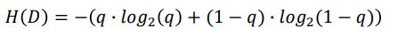
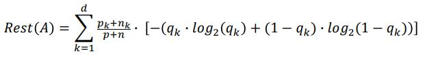
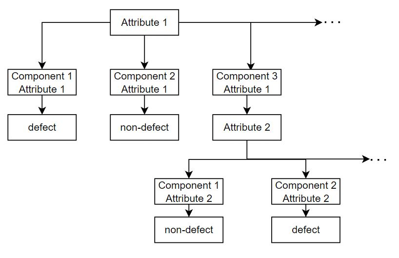

```{r setup, include=FALSE, warning=FALSE}
knitr::opts_chunk$set(echo = TRUE)
```

# Packages Installation

 
```{r  libraries, message = FALSE,warning = FALSE}
# Make sure, that StringsAsFactors = FALSE
options(stringsAsFactors = F)

if(!require(install.load)){
  install.packages("install.load")
  library(install.load)
}

install_load("tidyverse", "moments", "plotly", "data.table", "fitdistrplus", "knitr")
library(tidyverse)
library(moments)
library(plotly)
library(data.table)
library(fitdistrplus)
library(knitr)
```


# General Task
## Task 1

### Data Import

In this task, we have to create a distribution of logistic delay of component K7. Two data sets were provided, which are `Komponente_K7.csv`, which contains production date, and `Logistikverzug_K7.csv`, which contains incoming date of the product. To start analyzing the data, we must import the data sets and set their column types accordingly.
```{r echo=TRUE, message = FALSE, warning = FALSE}
# For semicolon delimited
K7 <- read_delim("Data/Logistikverzug/Komponente_K7.csv",delim = ";",show_col_types = FALSE)[2:6]
K7$Fehlerhaft <- as.logical(K7$Fehlerhaft)
K7$Produktionsdatum <- as.Date(K7$Produktionsdatum,
                                          format = "%Y-%m-%d")  
# For comma delimited
LK7 <- read_delim("Data/Logistikverzug/Logistikverzug_K7.csv",delim = "," ,show_col_types = FALSE)[2:6]
LK7$Fehlerhaft <- as.logical(LK7$Fehlerhaft)
LK7$Wareneingang <- as.Date(LK7$Wareneingang,
                                          format="%Y-%m-%d")
```

### Data Preparation
After importing the data, we check if the column Fehlerhaft in both data sets are equal.
```{r Fehlerhaft colum check, echo=TRUE, message = FALSE, warning = FALSE}

Result<- K7$Fehlerhaft == LK7$Fehlerhaft
Result[FALSE]

```
Based on this result, the column Fehlerhaft are in both data sets equal. Now, both data sets K7 and LK7 can be combined by using `full_join()`. A column with the name Wochentag is created for the day of production date. Afterwards, all NA values in the column Produktionsdatum and Wareneingang are filtered. A column Warenausgang is created, if the day of production date is Friday and Saturday. If the production day is Friday and Saturday, the product can be sent only on Monday, hence the outgoing date equals to production date added by 3 or 2 respectively. For outgoing date of all other days, the production date is added by 1.
```{r  logistic delay calculation,echo=TRUE, message = FALSE, warning = FALSE}
logistics_delay <- K7 %>% 
  full_join(LK7, by = c("IDNummer","Herstellernummer", "Werksnummer","Fehlerhaft")) %>%
  mutate(Wochentag = weekdays(Produktionsdatum)) %>%  # Creates a new column Wochentag
  filter(!is.na(Produktionsdatum)) %>% # Filter NA values
  filter(!is.na(Wareneingang)) %>% # Filter NA values
  mutate(Warenausgang = ifelse(Wochentag == "Freitag",
                               Produktionsdatum +3,
                               ifelse(Wochentag == "Samstag",
                                      Produktionsdatum +2,
                                      Produktionsdatum +1))) 
```

The column Warenausgang can now be formatted in date-format. Logistic delay can then be calculated by substracting the incoming date (Wareneingang) with the outgoing date (Warenausgang).
```{r logistic delay formating ,echo=TRUE, message = FALSE, warning = FALSE}
logistics_delay <- logistics_delay %>%
  mutate(Warenausgang = as.Date(Warenausgang,
                                origin = "1970-01-01",
                                format="%Y-%m-%d")) %>% 
  mutate(Verzug = Wareneingang - Warenausgang)
```


### Task 1.a - Logistics Distribution

To determine the distribution of the logistic delay, we use the function `descdist` from the package `fitdistrplus`. To use this, the column Verzug needs to be converted in numeric. Afterwards, the column is analyzed for discrete distribution, since the data contains integer values. 
```{r}
# Convert Verzug column in numeric
logistics_delay$Verzug <- as.numeric(logistics_delay$Verzug) 

# Determine the logistics distribution
descdist(logistics_delay$Verzug, discrete = TRUE)

```
According to the Cullen and Frey graph, the logistics data follows negative binomial distribution. Based on the fact that the skewness value is positive and the mean value is slightly larger than median, the distribution is positively skewed (Source: https://www.vrcbuzz.com/karl-pearsons-coefficient-of-skewness-using-r-with-examples/).


The skewness value is to analyze the symmetrie or the lack of symmetrie  of the distribution. In this case it is  possible to observe that this is negative. The value is -0,84. This means that the tail is on the left side of the distribution. The kurtosis value is greather than 3, it is said to be leptokurtic.This means that there are more chances to be outliers and that the distribution is peakead and haslong tails (thick)
```{r logistic distribution, warning= FALSE}
summary(logistics_delay$Verzug)
#skew(logistics_delay$Verzug)
mean <- mean(logistics_delay$Verzug)
median <- median(logistics_delay$Verzug)
stdev <- sd(logistics_delay$Verzug)
skewness <-3*(mean-median)/stdev #Pearson’s Coefficient of Skewness using the median
kurtosis<-kurtosis(logistics_delay$Verzug)
cat("skewness: ",skewness)
cat("kurtosis: ",kurtosis)
#https://www.vrcbuzz.com/karl-pearsons-coefficient-of-skewness-using-r-with-examples/
```


### Task 1. b - Logistics Delay Mean
To calculate the mean, following code is implemented.
```{r mean , echo=TRUE, message=FALSE,warning = FALSE}
mean <- as.numeric(mean(logistics_delay$Verzug)) 

# Ausgeben der Ergebnisse
cat("Mean = ", mean)
```
### Task 1.c -  Visualization
To determine the bin width for our histogram, we calculate the difference between Max, in our data equals to 14, and Min value, in our data equals to 1, of the delays and divide it by the total number of bins, in this data equals to 14. So the bin width is:

```{r echo = TRUE, warning = FALSE}
binwidth <-(14-1)/14
cat("Binwidth = ", binwidth)
```
Since the calculated binwidth is 0,9, it would make much more sense to round it to 1, because the delay days are integer numbers. The data can be plotted as follows:

```{r warning = FALSE}

logistics_delay_plot <- ggplot(logistics_delay, aes(x = Verzug ))+
  geom_histogram(aes(y = stat(density)),colour="black", fill="white", binwidth=1)+
  scale_x_continuous(breaks = c(0:14))+
  geom_density( fill="#FF6666",adjust = 10,alpha = 0.5) 


ggplotly(logistics_delay_plot)
```

### Task 1.d - Decision Tree
To create a decision tree, its important to know what and how many attributes there are, that influence the defect of component K7. Based on the data set K7, there are four columns that could be relevant. These are IDNummer, Produktionsdatum, Herstellernummer and Werksnummer. It could be noticed, that the IDNummer, Hersteller, and Werksnummer contain similar information. Herstellernummer and Werksnummer are directly connected, hence both should not be considered as different attribute. Inside the IDNummer, Herstellernummer and Werksnummer are also included and followed by the serie number of production. Hence, the IDNummer should also not be included as a different attribute. Based on this, the defect of component K7 is attributed solely from Produktionsdatum and Herstellernummer. The data set could be summarized as follow:

```{r}
K7_decision_tree <- K7 %>% 
  dplyr::select(Produktionsdatum, Herstellernummer, Fehlerhaft) %>% 
  arrange(desc(Fehlerhaft))

head(K7_decision_tree)
tail(K7_decision_tree)
```

The next step would be to determine, which of the attributes can be considered as root characteristics. To do this, we have to measure Information Gain value $IG(D,A)$ by applying each attribute A of both Produktionsdatum and Herstellernummer to the destination attribute D, which is in this case Fehlerhaft . This can be calculated by substracting $H(D)$, which is the entropy of the datset of destination attribute D, with $Rest(A)$, which is the remaining entropy that is still there after testing attribute A.

To calculate entropy of the dataset D, following equation is used, whereby the variable $q$ describes the proportion of defective components to the total number of components:
```{r echo = FALSE, fig.show = "hold", out.width = "40%", fig.align = "center"}


```

Afterwards, we can calculate the remaining entropy of each attributes (Produktionsdatum and Herstellernummer) by using following equation:

```{r echo = FALSE, fig.show = "hold", out.width = "50%", fig.align = "center"}


```
For this, $p_{k}$ and $n_{k}$ corresponds with the number of defective and non-defective components in correlation with each component of corresponding attributes. $q_{k}$ can be calculated by dividing $p_{k}$ with the sum of $p_{k}$ and $n_{k}$. By using this equation, we can calculate the remaining entropy for both Produktionsdatum - $Rest(Produktionsdatum)$ - and Herstellersnummer - $Rest(Herstellersnummer)$ and hence determine the Information Gain for both $IG(D, Produktionsdatum$ and $IG(D, Produktionsdatum)$. The attribute with the largest information gain would then be selected as the root attribute and the other as the sub-attribute. The decision tree may look as follow.

```{r echo = FALSE, fig.show = "hold", out.width = "75%", fig.align = "center"}


```

## Task 2 Data Base Structure

It is reasonable to save data in separate files instead of one huge table, because:

1. More stable in term of losing information, if user somehow accidentally deletes 1 file, it won't affect all other tables.
2. The user can do pick and choose, that means the user can decide which data they want to read and there is not need to read and load the whole table.
3. NULL values would not then be accumulated. In our case study, if we create only 1 data set containing all vehicles with their parts, some vehicles would have T16 part, but the majority doesn't, which would result in to a data set with almost full column of NULL values.
4. It is quicker to find information in separate files, because the size of separate file is smaller than the size of the whole table.
5. More Flexibility in terms of memory because each file can be store on different servers.
6. It is more secure. In one hand, it would be possible to manage the access to the data therefore the users would get permissions to what they need and not to the whole data set. On the other hand, if an account gets hacked, the hacker would only see part of the information but the the whole data.

Provided structure represents a relational database structure. It contains reference keys, binding tables and built on table basis.

## Task 3 Components
To determine the number of cars that were build with T16 parts and got registered in ADELSHOFEN, it is necessary to know the id of the cars that have a T16 part.
```{r reading zulassung,warning = FALSE}
# Reading Zulassung File
zulassung <- read_delim("Data/Zulassungen/Zulassungen_alle_Fahrzeuge.csv",delim = ";",show_col_types = FALSE)
zulassung_adel=zulassung%>%filter(Gemeinden =="ADELSHOFEN")
```


```{r reading Bestandteile Komponente, warning = FALSE }
# Reading T16 Teil Komponente

T16_Kom_1 <- read_delim("Data/Komponente/Bestandteile_Komponente_K2LE2.csv",
                        delim =";",
                        show_col_types = FALSE) %>%
  dplyr::select("ID_T16","ID_K2LE2")

names(T16_Kom_1)[2] <- "ID_Sitze"

T16_Kom_2 <- read_delim("Data/Komponente/Bestandteile_Komponente_K2ST2.csv",
                        delim =";",
                        show_col_types = FALSE) %>%
  dplyr::select("ID_T16","ID_K2ST2")

names(T16_Kom_2)[2]<-"ID_Sitze"
```

```{r reading Komponente,warning = FALSE}

Kom_K2LE2<- read.delim("Data/Komponente/Komponente_K2LE2.txt",sep ="\\")%>%dplyr::select(c("ID_Sitze","Werksnummer")) # not need to read it doesnt give any extra info
Kom_K2ST2<-read_delim("Data/Komponente/Komponente_K2ST2.csv",delim = ";",show_col_types = FALSE)%>%dplyr::select(c("ID_Sitze","Werksnummer"))
T16_K2LE2<-T16_Kom_1%>%left_join(Kom_K2LE2,by="ID_Sitze")
T16_K2ST2<-T16_Kom_2%>%left_join(Kom_K2ST2,by="ID_Sitze")
T16_Kom_bind<-rbind(T16_K2LE2,T16_K2ST2)
```
```{r Bestandteil Fahrzeug  ,warning = FALSE}
#read Bestandteil Fahrzeuge and combine them
Kom_Fahr_1<-read_delim("Data/Fahrzeug/Bestandteile_Fahrzeuge_OEM2_Typ21.csv",delim = ";",show_col_types = FALSE)%>%dplyr::select(c("ID_Sitze","ID_Fahrzeug"))
Kom_Fahr_2<-read_delim("Data/Fahrzeug/Bestandteile_Fahrzeuge_OEM2_Typ22.csv",delim =";",show_col_types = FALSE)%>%dplyr::select(c("ID_Sitze","ID_Fahrzeug"))
Kom_Fahr_bind<-rbind(Kom_Fahr_1,Kom_Fahr_2)
```
```{r creating dataset,warning = FALSE}
#join the different datasets to create a dataset that only contains the IDs of the components that where produced in ADELSHOFEN
Kom_Fahr <- T16_Kom_bind %>%left_join(Kom_Fahr_bind, by ="ID_Sitze")
Kom_Fahr_Adel <-Kom_Fahr%>%inner_join(zulassung_adel,by =c("ID_Fahrzeug"="IDNummer"))


```
Number of Cars register in ADELSHOFEN:
```{r cars in Adelshofen ,warning=FALSE}
cat("Cars registered at Adelshofen",nrow(Kom_Fahr_Adel))
```

## Task 4 Data Type Attributes 
The data type of the table "Zulassung" is shown with the str() function
```{r zulassung data type,warning = FALSE}
str(zulassung)
```
The data types are explained in the following table:
```{r echo = FALSE}
table <- data.frame("Attribute" = c("...1", "IDNummer", "Gemeinden", "Zulassung"), 
                    "Data Type" = c("Numeric", "Character", "Character", "Date"), 
                    "Description" = c("This data type contains numbers that represents unique index of each registeration", 
                                      "This data type contains strings with vehicle type, its OEM number, its factory, and its unique index",
                                      "This data type contains strings of registration location",
                                      "This data type contains date of registration"))

kable(table)
```


## Task 5 Server 
To save the records on the database of a server has the advantage that no local memory is occupied but more importantly, a permanent access to the most recently data records can be guaranteed in most cases , with a few exception as for example when maintenance takes place. 

Since databases tend to store a large amount of data, this could cause the computer to slow down. Also the quality of the data deteriorate very fast, since the data doesn't get updated. 

"RStudio Shiny Server Open Source" allows customers to get access to the app from anywhere with any web browser. To share the app, the code can be uploaded to git, for example, as a public repository.

## Task 6 Car Rsegistration
In order to find out where car with the chasis "K5-112-1122-79" got registered, it is important to know the car ID. This is possible by reading the file "Bestandteile Fahrzeuge"
```{r registration,warning = FALSE}
car<-read_delim("Data/Fahrzeug/Bestandteile_Fahrzeuge_OEM1_Typ12.csv",delim =";",show_col_types = FALSE)%>%dplyr::select(c("ID_Karosserie","ID_Fahrzeug"))%>%filter(ID_Karosserie == "K5-112-1122-79")
car_registerd<-filter(zulassung, IDNummer == car$ID_Fahrzeug)
gemeinden <- as.character(car_registerd$Gemeinden)
cat("Car with ID Karosserie'K5-112-1122-79' got registered in ",
    gemeinden) 
```


